# Documentació dels exercicis de recapitulació
 
Tipus de dades, operadors i control de flux en JavaScript.
 
- **Versió consola ([`ex-consola/`](ex-consola/))**: els 10 exercicis, executats amb Node.js o amb la consola del navegador.
- **Versió navegador ([`ex-navegador/`](ex-navegador/))**: els exercicis 1, 2, 4, 7 i 10, amb `alert`, `prompt` i `document.writeln`. Es pot obrir des de [`index.html`](ex-navegador/index.html).
---
 
## Part 1: Versió consola
 
### Exercici 1: Major de dos nombres
 
**Fitxers:** [`01-major-dos-nombres.js`](ex-consola/01-major-dos-nombres.js) i [`01-major-dos-nombres-v2.js`](ex-consola/01-major-dos-nombres-v2.js)
 
La funció `quinEsMajor(a, b)` compara els dos paràmetres amb `if/else` i retorna el més gran. 
 
La **versió 2** fa el mateix amb l'operador ternari: `return a > b ? a : b;`. És més curta, però igual de llegible per a una condició simple.
 
### Exercici 2: Nom d'una resolució
 
**Fitxer:** [`02-nom-resolucio.js`](ex-consola/02-nom-resolucio.js)
 
`nomResolucio(amplada, altura)` encadena `if / else if` amb `&&`, de manera que només coincideix si l'amplada **i** l'altura són les d'una resolució coneguda. Si no n'hi ha cap, la funció no retorna res (`undefined`) i, a fora, un `if (nom == undefined)` mostra un missatge d'error en lloc d'escriure `undefined`.
 
| Nom | Amplada x altura |
|---|---|
| 8K | 7680 x 4320 |
| 4K | 3840 x 2160 |
| WQHD | 2560 x 1440 |
| FHD | 1920 x 1080 |
| HD | 1280 x 720 |
 
### Exercici 3: Element d'un array
 
**Fitxer:** [`03-element-array.js`](ex-consola/03-element-array.js)
 
`getByIdx(arr, idx)` valida l'índex abans d'accedir a l'array. Un índex és invàlid si és menor que 0 (`idx < 0`) o si és igual o superior a la longitud (`idx >= arr.length`). En aquest cas retorna `"Valor no vàlid"`.
 
### Exercici 4: Nombres imparells
 
**Fitxers:** [`04-nombres-imparells.js`](ex-consola/04-nombres-imparells.js) i [`04-nombres-imparells-v2.js`](ex-consola/04-nombres-imparells-v2.js)
 
La versió 1 recorre del 0 al 10 amb un `for` i escriu només els que compleixen `!(i % 2 == 0)`. L'operador `%` retorna el residu de la divisió: si el residu és 0 el nombre és parell.
 
La **versió 2** comença a `i = 1` i incrementa de 2 en 2 (`i = i + 2`). Així tots els valors ja són imparells i no cal cap `if`. 
 
### Exercici 5: Menor i major d'un array
 
**Fitxer:** [`05-menor-i-major-array.js`](ex-consola/05-menor-i-major-array.js)
 
`getMenorMajor(arr)` parteix del primer element com a candidat a major i a menor, i recorre l'array actualitzant els dos valors quan en troba un de més gran o de més petit. Retorna `[major, menor]`. La condició del bucle és `i < arr.length`. 
 
### Exercici 6: Comptar nombres positius
 
**Fitxer:** [`06-comptar-positius.js`](ex-consola/06-comptar-positius.js)
 
`comptadorPositus` s'incrementa cada vegada que `arr[i] > 0`. **Decisió sobre el 0:** no es considera positiu, ja que la condició és `> 0` i no `>= 0`.
 
### Exercici 7: Preu amb impostos
 
**Fitxer:** [`07-preu-amb-impostos.js`](ex-consola/07-preu-amb-impostos.js)
 
`preuComplet(preu, impost)` calcula `preu + preu * impost`, amb l'impost en decimal (`0.15` és el 15%). El resultat s'acurta amb `toFixed(2)`, que retorna un **string** amb dos decimals.
 
### Exercici 8: Objectes a parelles
 
**Fitxer:** [`08-objectes-a-parells.js`](ex-consola/08-objectes-a-parells.js)
 
`toPairs(arr)` recorre l'array d'objectes i crea, per a cada un, una parella `[id, objecte]`. El resultat és un array d'arrays: `[[1, {...}], [2, {...}], ...]`.
 
### Exercici 9: Parelles a objectes
 
**Fitxer:** [`09-parells-a-objectes.js`](ex-consola/09-parells-a-objectes.js)
 
L'operació inversa: de cada parella `[id, objecte]` es treu l'objecte (`arr[i][1]`) i se li afegeix la propietat `id` (`arr[i][0]`).
 

 
### Exercici 10: Crear un array
 
**Fitxer:** [`10-crear-array.js`](ex-consola/10-crear-array.js)
 
`crearArray(n)` omple un array buit amb un `for` que va de 0 a `n - 1` i guarda `i + 1` a cada posició. Per a `n = 4` el resultat és `[1, 2, 3, 4]`.
 
---
 
## Part 2: Proves al navegador
 
Per a cada prova s'inclouen diverses captures: el `prompts` i les pàgines amb el resultat.
 
### Exercici 1: Major de dos nombres
 
**Fitxer:** [`01-major-dos-nombres.js`](ex-navegador/js/01-major-dos-nombres.js)
 
Es demanen dos valors amb `prompt` i es converteixen amb `Number()`. El resultat s'escriu amb `document.writeln`.
 
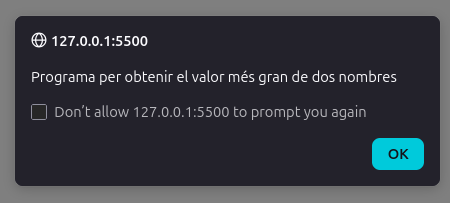

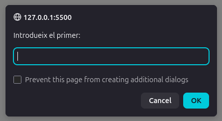

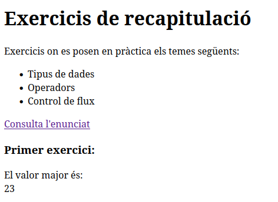
 
### Exercici 2: Nom d'una resolució
 
**Fitxer:** [`02-nom-resolucio.js`](ex-navegador/js/02-nom-resolucio.js)
 
Es demanen l'amplada i l'altura. Aquí **no** es converteix a `Number` perquè l'operador `==` fa la conversió automàtica de text a nombre (`"1920" == 1920` és `true`). Si no hi ha cap coincidència, el programa mostra un missatge d'error a la pàgina.
 
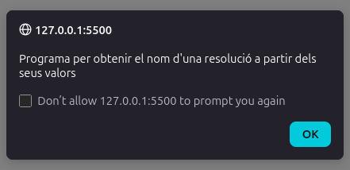
 
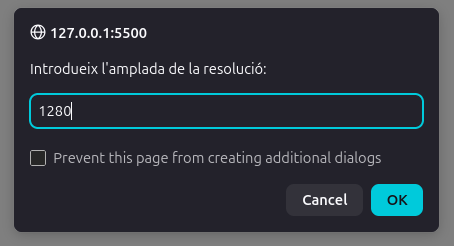

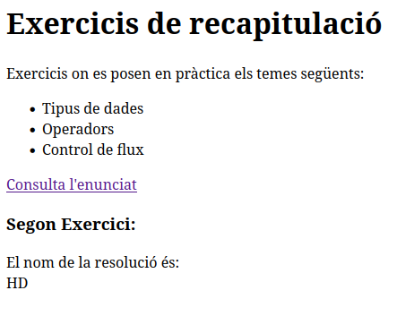

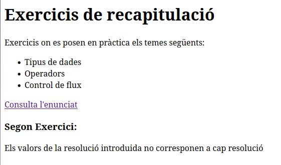
 
### Exercici 4: Nombres imparells
 
**Fitxer:** [`04-nombres-imparells.js`](ex-navegador/js/04-nombres-imparells.js)
 
Es demana fins a quin nombre es vol arribar i es mostren només els imparells, amb un ` ` entre línies perquè cada un surti en una línia diferent.

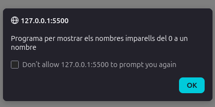

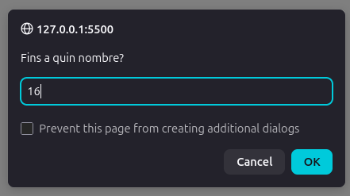

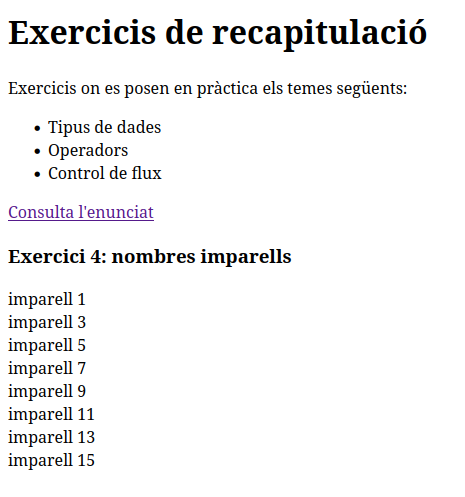
 
### Exercici 7: Preu amb impostos
 
**Fitxer:** [`07-preu-amb-impostos.js`](ex-navegador/js/07-preu-amb-impostos.js)
 
Es demanen el preu i l'impost **en percentatge** (15), perquè sigui més amigable per a l'usuari. Abans de cridar la funció es divideix entre 100 per passar-lo a decimal, tal com demana l'enunciat.
 

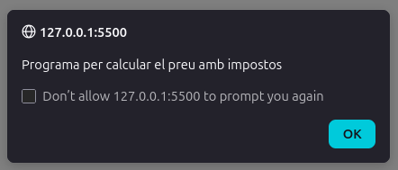
 
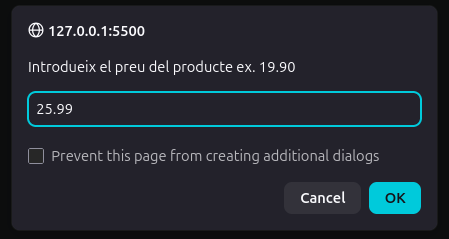

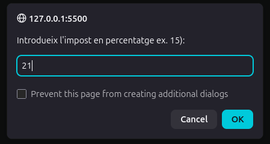

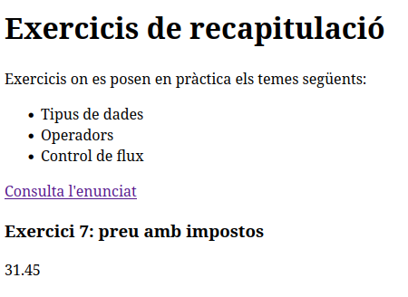
 
### Exercici 10: Crear un array
 
**Fitxer:** [`10-crear-array.js`](ex-navegador/js/10-crear-array.js)
 
Es demana la longitud `N` i es mostra l'array generat, per exemple `Per a N = 4: [1,2,3,4]`.
 
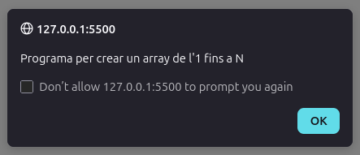 
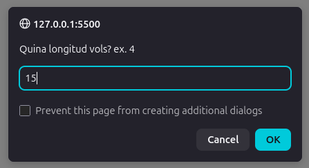

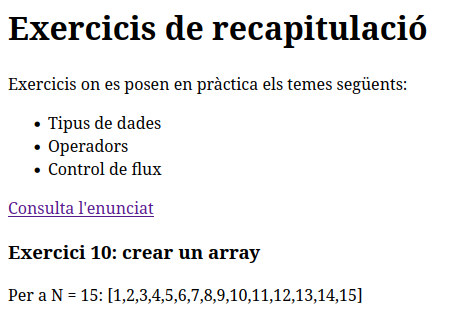
 
---
 
